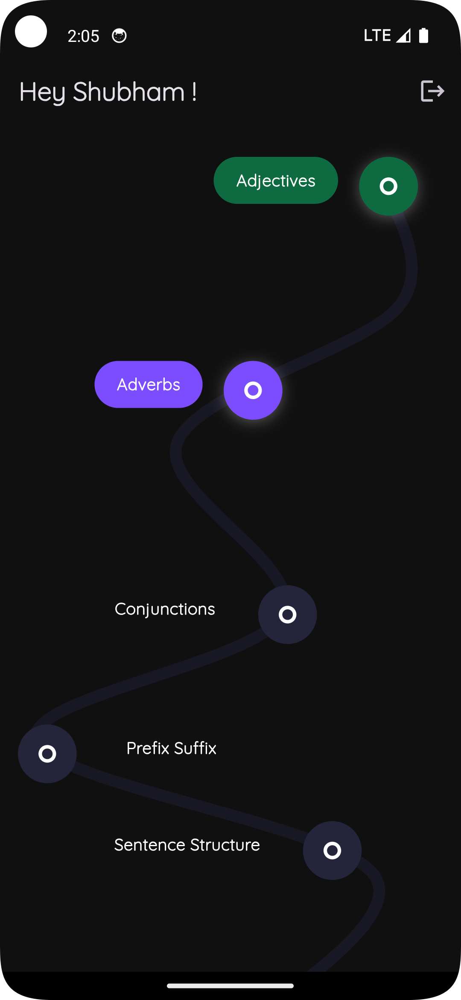
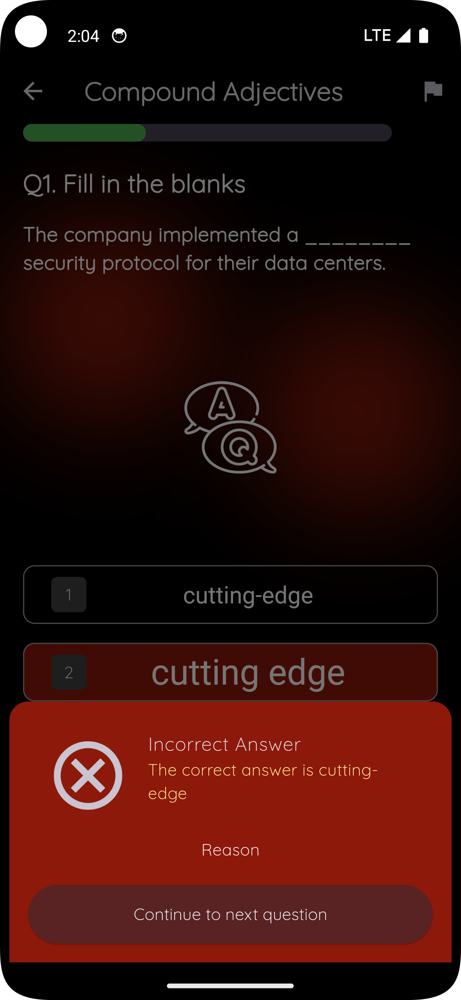
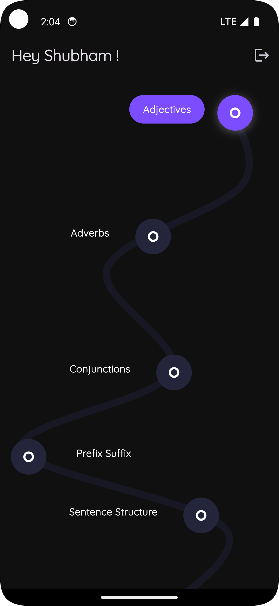

# Stimassign

English Exercise App is designed to help users improve their language skills through interactive and engaging exercises. With both offline and online capabilities, the app provides personalized feedback, tracking progress, and customized challenges to suit every learner.

## App Screenshots

<p align="center">
  
  
  
</p>

## Features

- **Interactive Exercises**: Practice grammar, vocabulary, and comprehension with dynamic quizzes.
- **Data Persistence**:
  - **Online**: Sync progress and data using Firebase integration.
  - **Offline**: Local storage ensures seamless learning without an internet connection.
- **Personalized Challenges**: Custom exercises tailored to the user's skill level.
- **Progress Tracking**: Visualize achievements and milestones with detailed reports.
- **Themes**: Switch between **Light** and **Dark Mode** for better usability.
- **State Management**: Powered by **Riverpod** for responsive and efficient user experience.

## App Structure

The app adheres to the **MVVM (Model-View-ViewModel)** architecture for modularity and scalability.

```
lib/
├── core/
│   ├── services/
│   │   ├── firebase_service.dart      // Firebase initialization, listeners
│   │   ├── navigation_provider.dart
│   │   └── shared_pref_helper.dart    // Local storage management
│   ├── error_handling/
│   │   ├── app_exception.dart
│   │   └── error_handler.dart
│   ├── utils/
│       ├── themes/
│       │   ├── app_theme.dart
│       │   └── theme_provider.dart
│       ├── animation.dart
│       ├── color_resources.dart
│       ├── dimensions.dart
│       ├── images.dart
│       ├── styles.dart
│       └── util.dart
├── data/
│   ├── models/
│   │   ├── grammar_model.dart
│   │   ├── vocabulary_model.dart
│   │   ├── comprehension_model.dart
│   │   └── progress_model.dart
│   ├── providers/
│   │   ├── grammar_provider.dart
│   │   ├── vocabulary_provider.dart
│   │   ├── comprehension_provider.dart
│   │   └── progress_provider.dart
│   └── repo/
│       ├── local_repo.dart            // Local database operations
│       └── remote_repo.dart           // Firebase operations (CRUD)
├── repository/
│   ├── repository.dart                // Central abstraction layer for data
│   └── repository_impl.dart           // Combines Firebase and local storage
├── view/
│   ├── components/
│   │   ├── grammar_quiz.dart
│   │   ├── vocabulary_card.dart
│   │   └── comprehension_task.dart
│   ├── screens/
│       ├── home_screen.dart
│       ├── progress_screen.dart
│       ├── exercise_screen.dart
│       └── splash_screen.dart
└── main.dart
```

## Technology Stack

- **Flutter**: Cross-platform UI framework.
- **MVVM Architecture**: Ensures a clean separation of concerns and testability.
- **Riverpod**: State management for seamless user experience.
- **Firebase**: Real-time database and authentication.
- **SharedPreferences**: Offline storage for user progress.

## Setup & Compilation Instructions

### Prerequisites:
- Dart version: 3.5.4
- DevTools version: 2.37.3
- Flutter version: 3.24.5 (Stable)

### Steps:
1. Clone the repository.
2. Open the project in Android Studio or VS Code.
3. Run `flutter pub get` to fetch all dependencies.
4. Connect a physical or virtual device for testing.
5. Execute `main.dart` to launch the app.

## Usage

- **Online Mode**: Ensure internet connectivity to sync progress with Firebase.
- **Offline Mode**: All progress is saved locally, enabling uninterrupted usage.
- **Exercises**: Choose from grammar, vocabulary, and comprehension modules.
- **Track Progress**: Review your achievements and areas for improvement in the progress screen.
- **Switch Themes**: Toggle between Light and Dark mode in the settings.

## Design Decisions

- **Scalability Focus**: The MVVM architecture ensures the app is extensible and maintainable.
- **Custom Animations**: Engaging animations enhance user interaction and experience.
- **Caching & Error Handling**: Robust mechanisms for offline access and error recovery.
- **Dynamic Content**: Challenges and quizzes adapt to the user's progress and performance.


---
Developed by Shubham choudhary
